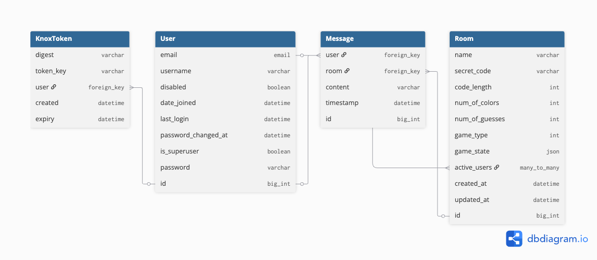

## Implementation Decisions

- Main challenge: keeping all players synchronized with real-time game state
- Solution: WebSocket connections for live updates + initial game state request

## Django-Ninja API Framework

For the backend framework, I chose Django-Ninja over Django REST Framework and FastAPI.

Like DRF, Ninja follows the MVT pattern, but it requires less boilerplate and uses a declarative syntax with type annotations that make code easier to maintain (Viewsets, nested Serializers).

Django-Ninja has all the benefits of FastAPI (Pydantic, Async, auto documentations) so I decided to use Ninja instead.

I opted not to use **Django-Ninja-Extra** because its class-based views introduced unnecessary complexity and generated schemas incompatible with the React API client generators (openapi-ts, swagger-typescript-api)

## Django Channels for WebSocket Support

- Real-time bidirectional communication
- Instant game updates without polling
- Integrates with Django authentication
- Channel layer abstraction for room broadcasting

## API Endpoints

### Player Authentication with Knox
- Registration and login with Knox tokens
- Token refresh for session maintenance
- Works with HTTP but not implemented for Websocket
- See **Custom Knox Token Authentication** below

### Game Creation and Joining
- Configurable game parameters (code length, colors, max guesses)
- Create game room -> create websocket connection
- Join game rooms
- Game state is stored inside the `game_state` field in the `Room` model

Guess submission (`/check`) and creating quick play rooms (`/quick-play`) HTTP endpoints were added when testing single-player game, but was not added use Websocket for real-time game updates.

## PostgreSQL Database Integration

Postgres was chosen because it supports a native JSON type for storing the game state. 

Without Postgres, I would have needed to create a separate GameState model, which would have been less flexible than storing the data directly in a JSON column.

## WebSocket Connections

Websocket connection was handled with Django-channels. 
I have added four different message types for this project: 

- `connect`: join room
- `disconnect`: leave room
- `receive`: receive messages from client
  - There are two message/event types:
    - `make_move`: players submitting guess
    - `game_update`: game state update

**Note**

- Messages are sent from the client using `sendGameMessage()` in `useGameWebSocket.ts`.

## Redis

`Django-Channel[redis]`, `channel-redis[daphne]` was used for this project.

The main reason to use a Redis channel layer is for data **persistence**.

If the project doesn't use Redis backend and the Backend server shuts down for some reason, then all active websocket rooms are lost.

### Custom Knox Token Authentication

This project uses custom knox token django app tailored for Django-Ninja. Knox gives you the same easy server-side control over logins that sessions do, but without storing tokens in plaintext like DRF’s default auth. Unlike JWTs, which are tricky to revoke once they’re out in the wild, Knox keeps only a hashed version on the server(database) so you can kill a single device’s login or all of them instantly. It’s a great fit for APIs that need secure, multi-device logins without the headache of managing JWT blacklists or heavy session state. Since Knox tokens are stored in a securely hashed form, even if someone gets access to the database, they can’t use the stored token to log in.

I'm including this in the project mainly because I've worked with it before at a startup and I love it very much.

#### See Also

- [Test Driven Django + React Websocket tutorial (django-channels)](https://testdriven.io/courses/taxi-react/websockets-part-one/)
- [django-ninja unlocking its full potential](https://medium.com/django-unleashed/django-ninja-unlocking-its-full-potential-part-2-a4e0b5a6ad1b#b26b)
- [FastAPI realtime streaming](https://stribny.name/posts/real-time-data-streaming-using-fastapi-and-websockets/)
