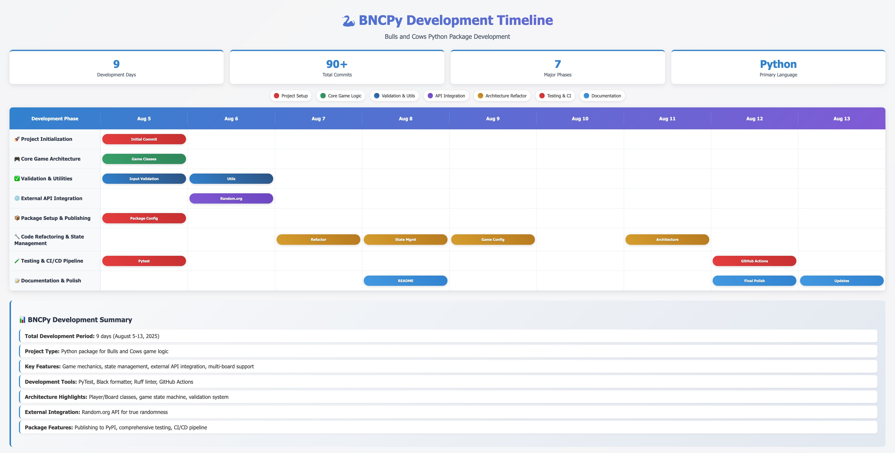
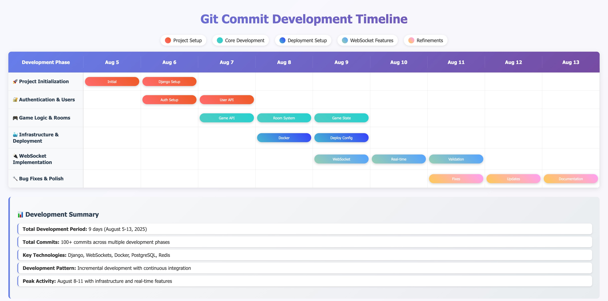
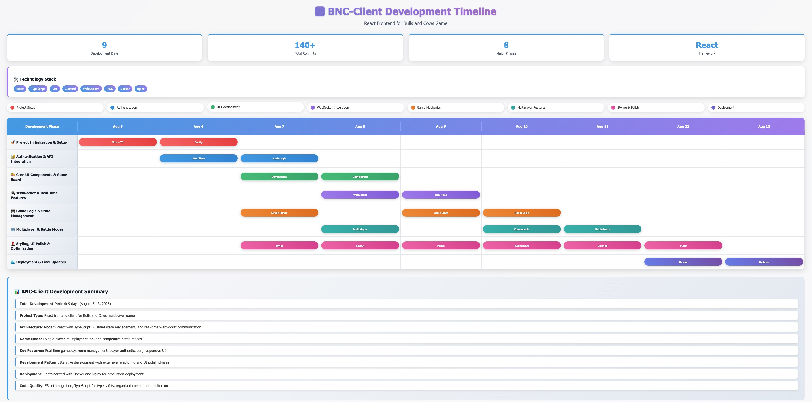

## Game Library timeline - bncpy

[Click to see page](https://jwc20.github.io/bnc-docs/bncpy_gantt_chart.html)

    

## Backend timeline - bncapi

[Click to see page](https://jwc20.github.io/bnc-docs/bncapi_gantt_chart.html)

    
    

## Frontend timeline - bnc-client
[Click to see page](https://jwc20.github.io/bnc-docs/bnc_client_gantt_chart.html)

    

### Note

- The dates are in **Korean (KST) Time zone**.
- The image/pages above was generated with `git log --pretty=format:"%h %ad %s" --date=short > formatted_history.txt` command and claude LLM.
- [Old Timeline Gantt Chart](https://docs.google.com/spreadsheets/d/1Y-7nZ5pecxm9lFmjrzJtx5n0Om_LI2fHTfN1ySws81Q/edit?usp=sharing)

