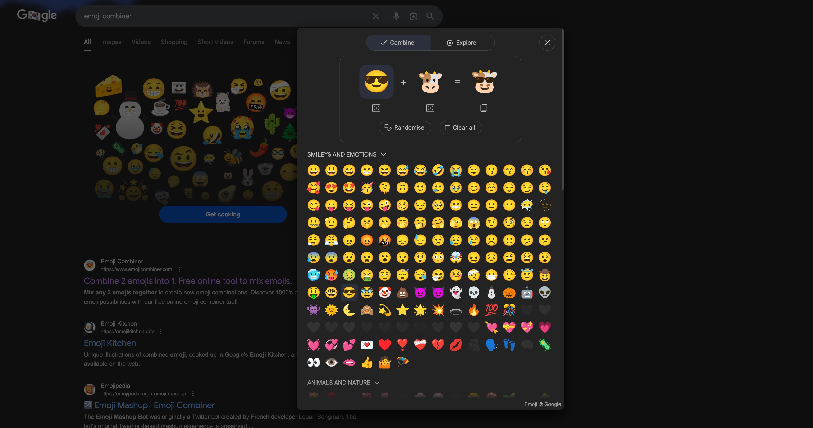
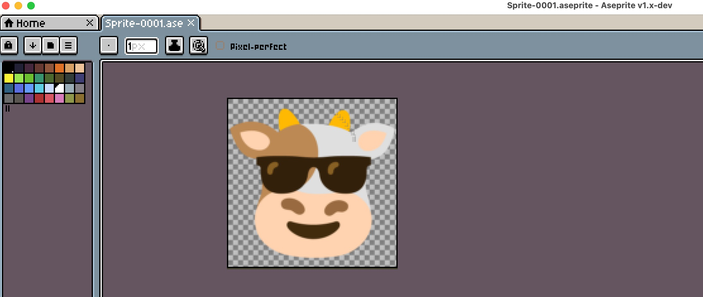

Here are the list of tools and resources that I have used to create this project.

- Pycharm, Webstorm (great debuggers)
- Docker
- iTerm2
- Neovim
- Lazygit, Lazydocker, Lazynpm
- AI/LLMs (Claude, Cursor)

### AI/LLM and Research

The core architecture, game logic, and API design were developed independently. 
AI assistance was most heavily used for frontend styling, visual components, and fixing typescript lint errors, giving me more time to focus on the multiplayer component and game mechanics.

### etc.

The icon was made with Google's emoji combiner and pixelated using [aesprite](https://gist.github.com/allangarcia/938b052a7d55d1652052e4259364260b?permalink_comment_id=5598468#gistcomment-5598468).

<!-- 

    
    

 -->

    